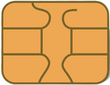

# Credit card 
## Final design 

## font used
- [Montserrat](https://fonts.googleapis.com/css2?family=Montserrat:ital,wght@0,400;0,500;1,400&display=swap)
- [Pacifico](https://fonts.googleapis.com/css2?family=Pacifico&display=swap)

## Images 
- Chip image\

- Master card logo\

- Background image

## Original 
[ASMR Programming - Credit Card UI Design - No Talking](https://www.youtube.com/watch?v=5DFvs2qyEvo&list=PLSFk-30fkoI7YzVOPJzJbu1RlZ8Als6CN&index=10&ab_channel=Codeminton)